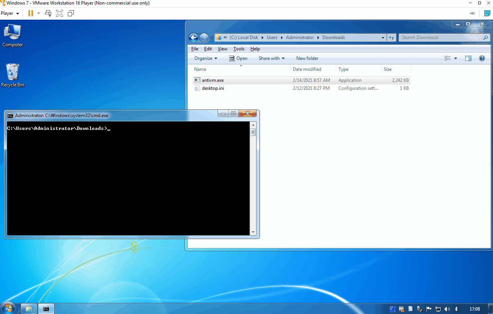
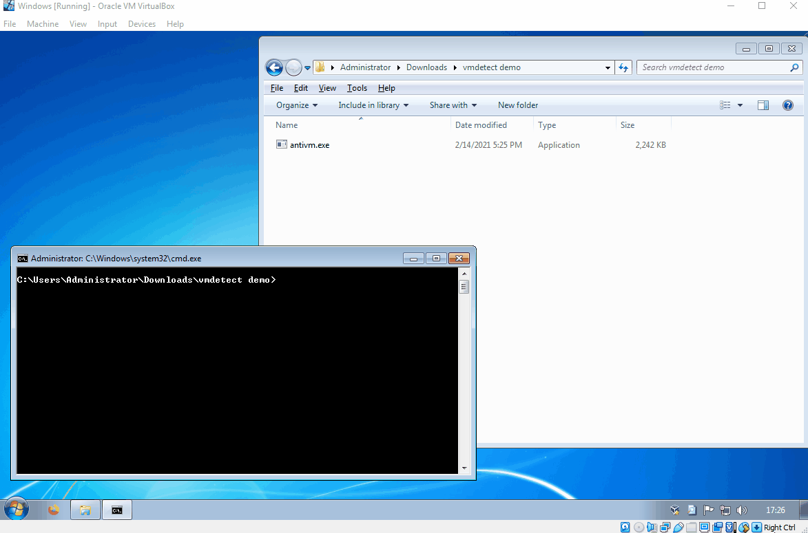

# VMware and VBox Detector 👋


=

=


## ✨ Overview ✨
• Detects VMware (If VMware tools are installed)
• Detects Oracle VirtualBox
• Self deletes if a vm is detected

## Prerequisites

Uses standard libraries
Can be built using g++ (Sometimes cannot run on VMs using gcc unsure why)
```
g++ antivm.cpp -o antivm.exe -static-libgcc -static-libstdc++
```

## Demo 🎥
### VMware Demonstration

### VirtualBox Demonstration


## Author

- char*#1337 on discord
- mayhapsDev on GitHub

## 🤝 Contributing

Contributions, issues and feature requests are welcome!

Feel free to check 

## Show your support

Give a ⭐️ if this project helped you!


## 📝 License

No licence
